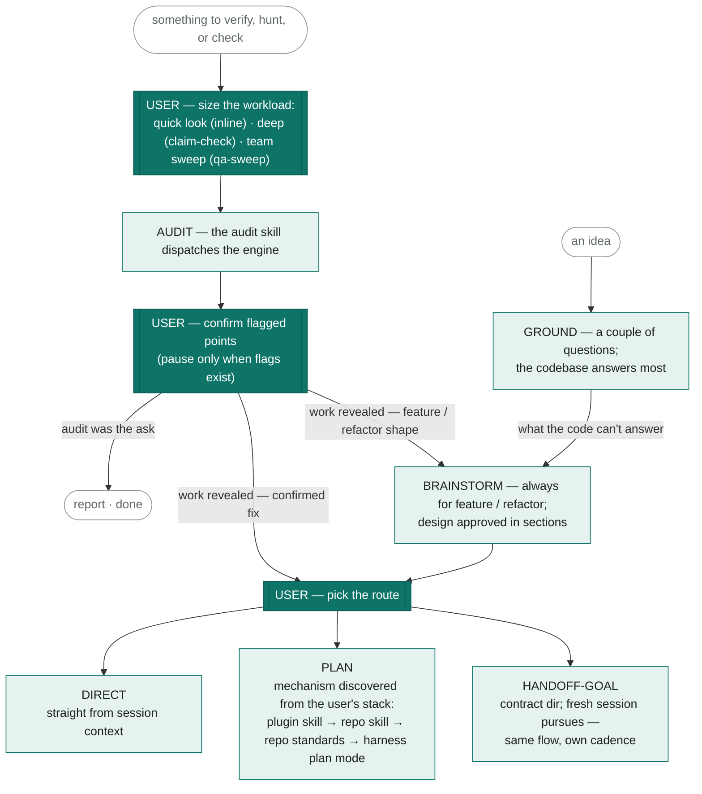
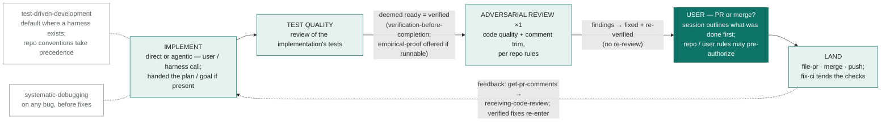

# The workbench flow

Canonical mental model of the **workbench** system's workflow — how work enters,
gets scoped, gets implemented, and lands. Filled teal boxes are **user gates**
(the user decides); everything else the session drives. Decisions and rationale:
[`decisions/workbench-system.md`](decisions/workbench-system.md). Designed
interactively on a whiteboard artifact (v7, 2026-08-11).

**Canonical pair:** this file (mermaid, diffable) and
[`workbench-flow.html`](workbench-flow.html) (arch-map rendering) are maintained
together — a flow change updates both or neither. Workbench skills are identifiable
in code by their frontmatter tag: `metadata.system: workbench`.

## Entry & scoping — two optional doors

## Implementation — agency belongs to the user and the harness

## Not in the flow — removed deliberately

The superpowers pipeline this system replaced: the `using-superpowers`
dispatcher and its SessionStart hook, `subagent-driven-development`,
`executing-plans`, `writing-plans`, `requesting-code-review`,
`dispatching-parallel-agents`, `using-git-worktrees`,
`finishing-a-development-branch`. Per-piece rationale lives in the workbench
manifest (`.claude/skills/workbench-drift/manifest.json` — repo-local fork
tooling). The removal is of *forced process* — execution agency itself stays
the user's call.

## Decisions ledger (operator, 2026-08-11 unless noted)

| # | Decision |
|---|---|
| Q1 | Brainstorming always precedes feature/refactor design; owns what the codebase can't answer about an idea. |
| Q2 | TDD is the default where a test harness exists; silent skip where none. |
| Q3 | Adversarial review fires once — at model-deemed readiness. |
| Q4 | Comment trimming rides that review, per repo rules. |
| Q5 | Fixed findings re-verify and proceed straight to the outline gate — no re-review. |
| Q6 | Review precedes landing; landing is outline-then-ask, with a rules bypass. |
| Q7 | The confirm gate pauses only when the audit flagged uncertainty. |
| Q8 | Audit sizes: quick look (inline) · deep (claim-check) · team sweep (qa-sweep). |
| Q9 | Audit-revealed work routes by shape: feature/refactor → brainstorm; confirmed fix → route. |
| Q10 | PLAN resolves through the user's stack: plugin skill → repo skill → repo standards → harness plan mode. |
| Q11 | "Deemed ready" = verification-before-completion; empirical-proof for runnable surfaces. |
| Q12 | Flow artifacts are disposable — saved under `.workbench/<work_scope>/` (or `.tmp/workbench/<work_scope>/`), enduring only for the work; durable only on explicit user ask or an established repo pattern. |
| Q13 | Implementation inherits repo patterns first: a stated repo/user convention that conflicts with a discipline step wins — announced, not absorbed silently; TDD is the default only where the repo is silent. (2026-08-12) |
| Q14 | Expensive verification (`empirical-proof`, `qa-sweep`) is user-optioned: offered when it fits, run only on explicit ask or standing authorization — never automatic. `verification-before-completion` is the only always-on gate. (2026-08-12) |
| Q15 | The adversarial review fires only when the work-stream's implementation is believed complete, right before the PR-or-merge gate — never mid-implementation (refines Q3). Findings outside the accepted scope become follow-ups unless they prove the change unsafe or incorrect. (2026-08-12) |
| Q16 | Stop and rescope when a change crosses owner areas the ask never named or grows well past the sized expectation — splitting is the user's call; scope never grows silently. Adjacent defects found along the way are recorded as follow-up work, not folded in. (2026-08-12) |
| Q17 | One evidence home per work scope (refines Q12): everything a work-stream produces — dispatched agents' evidence included — lands in the same `.workbench/<work_scope>/` folder, with the path handed to agents in their contract; never per-agent temp dirs, never the system temp. (2026-08-12) |
