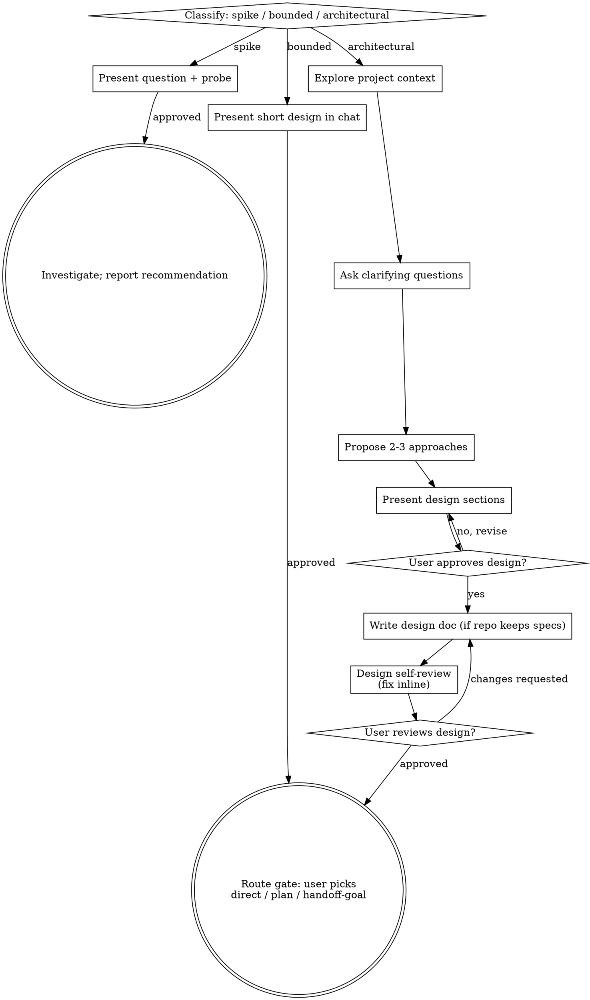

# Brainstorming Ideas Into Designs

Help turn ideas into fully formed designs through natural collaborative dialogue.

Start by classifying how much process the request actually needs, then work that
path: understand the context, refine the idea, present a design, get the user's
approval, and hand them the route decision.

**Rule:** no implementation before the design is presented and approved. Don't
write code, scaffold projects, or invoke implementation skills mid-brainstorm.
**The ceremony scales with the task; the approval gate never does.**

## Three paths

Before the first question, classify the request and say the classification out
loud: "this looks bounded, so I'll present a short design here rather than write
one up", so the user can override it.

- **Spike**: a feasibility question ("can we…", "is it possible…", "quick and
  dirty is fine") whose output is an answer, not code you keep. Present the
  question and what you'll try in two or three sentences, get a nod, then find
  out as cheaply as correctness allows. No design doc. Report findings as a
  recommendation, and label anything you built throwaway.
- **Bounded**: a well-scoped change to code that already exists here: a new
  flag, a small endpoint, a one-file fix. Understanding the *kind* of app is not
  enough: bounded means the flow you are changing is already in the repo to
  read. If there is no existing flow to change, it is not bounded. Ask the
  clarifying questions that matter, present a short design **in chat** (a few
  sentences to a few short paragraphs), and stop for approval. No design doc.
- **Architectural**: new projects, new subsystems, changes that restructure how
  components fit together or alter interfaces others depend on. The full process
  below: questions, approaches, sectioned design, a written design, self-review.

**The ratchet is one-way.** When torn between two paths, take the heavier one.
Hidden complexity discovered mid-task upgrades the path: stop, say so, and step
up. Nothing downgrades mid-task.

## Where this sits in the workbench flow

- **Scope:** features and refactors always get this treatment. Confirmed small
  fixes (e.g. a bug an audit already pinned down) skip it; work whose design was
  already settled elsewhere skips it. Entering does not mean the full ceremony:
  the path classification above decides how much, and most bounded work is a few
  questions and a short design in chat.
- **Entering from an idea:** ground the idea first: a couple of questions, most
  answerable from the codebase itself. Brainstorming owns the rest: the
  questions only the user can answer (intent, priorities, taste, constraints the
  code doesn't record).
- **Entering from an audit:** the findings and the user's confirmed flags are
  your context: don't re-derive them.
- **The terminal state is the route gate**, for bounded and architectural work
  alike. When the design is approved, present the user the three routes and let
  them pick: **direct** (implement straight from this conversation), **plan**
  (write one: using the user's own plan mechanism: a plugin or repo skill, the
  repo's planning standards, or the harness's plan mode as fallback), or
  **handoff-goal** (a contract for a fresh session to pursue autonomously). The
  choice is theirs, not yours; the path only shapes what you recommend: bounded
  work usually wants **direct**, architectural work usually wants **plan** or
  **handoff-goal**.
- **A spike is the exception**: its terminal state is a reported recommendation,
  not a route pick. There is nothing to route until the user turns the answer
  into work, and that is a fresh pass through this skill.

## Red flags

| Thought | Reality |
|---------|---------|
| "This is too simple to need a design" | Simple means a short design, not no design. Two sentences in chat, then approval. |
| "I'll call it bounded and skip the write-up" | Reaching for a label to skip work *is* the doubt. Take the heavier path. |
| "It's bounded and the design is obvious: I'll start while they read it" | The gate is the approval, not the design's length. Present, then stop until you hear yes. |
| "I understand this kind of app, so it's bounded" | Bounded measures the repo, not your familiarity. A new project has no existing flow to change, so the work is architectural. |
| "The spike works, so I'll keep the code" | A spike's output is an answer. Keeping the code is a new request: classify it. |
| "It grew, but I'm almost done: no need to re-classify" | Hidden complexity upgrades the path mid-task. Stop and say so. |
| "They approved the spike, so the follow-up is approved too" | Each task gets its own classification and its own approval. |

## Process

Classify first, announce the path, then work the checklist for that path in
order.

**Spike:** explore just enough to frame the probe → present the question and
probe plan in two or three sentences → get a nod → investigate as cheaply as
correctness allows → report a recommendation, labelling anything built
throwaway.

**Bounded:** explore project context (files, docs, recent commits) → ask the
clarifying questions that matter, one at a time → present a short design in chat
covering approach, files touched, and testing → **stop and wait for an explicit
yes** (presenting the design and starting in the same breath is skipping the
gate) → route gate.

**Architectural:** the full sequence below.

The subsections below serve the bounded and architectural paths; a spike stops
at "present the probe, get a nod." Everything from **Exploring approaches**
onward adds architectural depth. For bounded work, context plus a few questions
plus a short in-chat design is the whole process.

**Understanding the idea:**

- Check out the current project state first (files, docs, recent commits)
- Before asking detailed questions, assess scope: if the request describes
  multiple independent subsystems (e.g., "build a platform with chat, file
  storage, billing, and analytics"), flag this immediately. Don't spend
  questions refining details of a project that needs to be decomposed first.
- If the project is too large for a single design, help the user decompose into
  sub-projects: what are the independent pieces, how do they relate, what order
  should they be built? Then brainstorm the first sub-project through the
  normal flow. Each sub-project gets its own design → route → implementation
  cycle.
- **One question per message**: if a topic needs more exploration, break it
  into several. Answer from the codebase yourself whatever the codebase can
  answer; spend the user's attention only on what it can't.
- Prefer multiple choice questions when possible, but open-ended is fine too
- Focus on understanding: purpose, constraints, success criteria

**Exploring approaches:**

- Propose 2-3 different approaches with trade-offs
- Present options conversationally with your recommendation and reasoning
- Lead with your recommended option and explain why
- YAGNI ruthlessly: remove unnecessary features from every approach and design

**Presenting the design:**

- Once you believe you understand what you're building, present the design
- Scale each section to its complexity: a few sentences if straightforward, up
  to 200-300 words if nuanced
- Ask after each section whether it looks right so far
- Cover: architecture, components, data flow, error handling, testing
- Be ready to go back and clarify if something doesn't make sense

**Design for isolation and clarity:**

- Break the system into smaller units that each have one clear purpose,
  communicate through well-defined interfaces, and can be understood and tested
  independently
- For each unit, you should be able to answer: what does it do, how do you use
  it, and what does it depend on?
- Can someone understand what a unit does without reading its internals? Can
  you change the internals without breaking consumers? If not, the boundaries
  need work.
- Smaller, well-bounded units are also easier for you to work with; you reason
  better about code you can hold in context at once, and your edits are more
  reliable when files are focused. When a file grows large, that's often a
  signal that it's doing too much.

**Working in existing codebases:**

- Explore the current structure before proposing changes. Follow existing
  patterns.
- Where existing code has problems that affect the work (e.g., a file that's
  grown too large, unclear boundaries, tangled responsibilities), include
  targeted improvements as part of the design: the way a good developer
  improves code they're working in.
- Don't propose unrelated refactoring. Stay focused on what serves the current
  goal.

## After the Design

This section is the **architectural** path. Bounded work has no written design
to document, self-review, or re-approve; it goes from the in-chat design's
approval straight to the route gate at the end.

**Documentation:** the written design is **disposable working material**: save
it under `.workbench/<work_scope>/` (or `.tmp/workbench/<work_scope>/`), where
it endures only for the duration of the work. It becomes a durable, committed
doc only when the user explicitly asks, or when the repo has an established
design-doc convention (then write it where that convention says). Never quietly
promote it.

**Design self-review**: look at the written design with fresh eyes:

1. **Placeholder scan:** any "TBD", "TODO", incomplete sections, or vague
   requirements? Fix them.
2. **Internal consistency:** do any sections contradict each other? Does the
   architecture match the feature descriptions?
3. **Scope check:** is this focused enough for a single route, or does it need
   decomposition?
4. **Ambiguity check:** could any requirement be interpreted two different
   ways? If so, pick one and make it explicit.

Fix any issues inline. No need to re-review: just fix and move on.

**User review gate:** ask the user to review the design before proceeding. If
they request changes, make them and re-run the self-review. Only proceed once
they approve.

**Then use the route gate and stop.** Present the three routes with a one-line
read on which fits this work and why, and let the user pick. Ask with a
structured question tool (`AskUserQuestion` or the host's equivalent) when one
is available: user-facing labels, not skill names: **Direct**, **Plan**,
**Long-running goal**, each with a one-line description, the recommended route
first and marked "(Recommended)". Otherwise present the same options as a
numbered list and wait for the pick. Brainstorming never starts the
implementation itself.

---

*Derived from [obra/superpowers](https://github.com/obra/superpowers) (MIT, (c) Jesse Vincent), adapted for the workbench system.*
