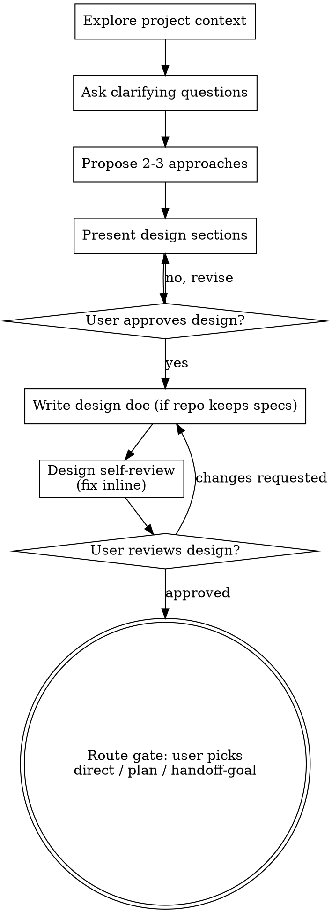

# Brainstorming Ideas Into Designs

Help turn ideas into fully formed designs through natural collaborative dialogue.

Start by understanding the current project context, then ask questions one at a
time to refine the idea. Once you understand what you're building, present the
design and get user approval — then hand the user the route decision.

**Rule:** no implementation before the design is presented and approved. Don't
write code, scaffold projects, or invoke implementation skills mid-brainstorm.

## Where this sits in the workbench flow

- **Scope:** features and refactors get this treatment — always. Confirmed small
  fixes (e.g. a bug an audit already pinned down) skip it; work whose design was
  already settled elsewhere skips it.
- **Entering from an idea:** ground the idea first — a couple of questions, most
  answerable from the codebase itself. Brainstorming owns the rest: the
  questions only the user can answer (intent, priorities, taste, constraints the
  code doesn't record).
- **Entering from an audit:** the findings and the user's confirmed flags are
  your context — don't re-derive them.
- **The terminal state is the route gate.** When the design is approved, present
  the user the three routes and let them pick: **direct** (implement straight
  from this conversation), **plan** (write one — using the user's own plan
  mechanism: a plugin or repo skill, the repo's planning standards, or the
  harness's plan mode as fallback), or **handoff-goal** (a contract for a fresh
  session to pursue autonomously). The choice is theirs, not yours.

## Process

**Understanding the idea:**

- Check out the current project state first (files, docs, recent commits)
- Before asking detailed questions, assess scope: if the request describes
  multiple independent subsystems (e.g., "build a platform with chat, file
  storage, billing, and analytics"), flag this immediately. Don't spend
  questions refining details of a project that needs to be decomposed first.
- If the project is too large for a single design, help the user decompose into
  sub-projects: what are the independent pieces, how do they relate, what order
  should they be built? Then brainstorm the first sub-project through the
  normal flow. Each sub-project gets its own design → route → implementation
  cycle.
- For appropriately-scoped projects, ask questions one at a time to refine the
  idea — and answer from the codebase yourself whatever the codebase can
  answer; spend the user's attention only on what it can't
- Prefer multiple choice questions when possible, but open-ended is fine too
- Only one question per message — if a topic needs more exploration, break it
  into multiple questions
- Focus on understanding: purpose, constraints, success criteria

**Exploring approaches:**

- Propose 2-3 different approaches with trade-offs
- Present options conversationally with your recommendation and reasoning
- Lead with your recommended option and explain why
- YAGNI ruthlessly — remove unnecessary features from every approach and design

**Presenting the design:**

- Once you believe you understand what you're building, present the design
- Scale each section to its complexity: a few sentences if straightforward, up
  to 200-300 words if nuanced
- Ask after each section whether it looks right so far
- Cover: architecture, components, data flow, error handling, testing
- Be ready to go back and clarify if something doesn't make sense

**Design for isolation and clarity:**

- Break the system into smaller units that each have one clear purpose,
  communicate through well-defined interfaces, and can be understood and tested
  independently
- For each unit, you should be able to answer: what does it do, how do you use
  it, and what does it depend on?
- Can someone understand what a unit does without reading its internals? Can
  you change the internals without breaking consumers? If not, the boundaries
  need work.
- Smaller, well-bounded units are also easier for you to work with — you reason
  better about code you can hold in context at once, and your edits are more
  reliable when files are focused. When a file grows large, that's often a
  signal that it's doing too much.

**Working in existing codebases:**

- Explore the current structure before proposing changes. Follow existing
  patterns.
- Where existing code has problems that affect the work (e.g., a file that's
  grown too large, unclear boundaries, tangled responsibilities), include
  targeted improvements as part of the design — the way a good developer
  improves code they're working in.
- Don't propose unrelated refactoring. Stay focused on what serves the current
  goal.

## After the Design

**Documentation:** the written design is **disposable working material** — save
it under `.workbench/<work_scope>/` (or `.tmp/workbench/<work_scope>/`), where
it endures only for the duration of the work. It becomes a durable, committed
doc only when the user explicitly asks, or when the repo has an established
design-doc convention (then write it where that convention says). Never quietly
promote it.

**Design self-review** — look at the written design with fresh eyes:

1. **Placeholder scan:** any "TBD", "TODO", incomplete sections, or vague
   requirements? Fix them.
2. **Internal consistency:** do any sections contradict each other? Does the
   architecture match the feature descriptions?
3. **Scope check:** is this focused enough for a single route, or does it need
   decomposition?
4. **Ambiguity check:** could any requirement be interpreted two different
   ways? If so, pick one and make it explicit.

Fix any issues inline. No need to re-review — just fix and move on.

**User review gate:** ask the user to review the design before proceeding. If
they request changes, make them and re-run the self-review. Only proceed once
they approve.

**Then the route gate — and stop.** Present the three routes with a one-line
read on which fits this work and why, and let the user pick. Ask with a
structured question tool (`AskUserQuestion` or the host's equivalent) when one
is available — user-facing labels, not skill names: **Direct**, **Plan**,
**Long-running goal**, each with a one-line description, the recommended route
first and marked "(Recommended)". Otherwise present the same options as a
numbered list and wait for the pick. Brainstorming never starts the
implementation itself.

---

*Derived from [obra/superpowers](https://github.com/obra/superpowers) (MIT, (c) Jesse Vincent), adapted for the workbench system.*
