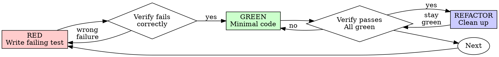

# Test-Driven Development (TDD)

## Overview

Write the test first. Watch it fail. Write minimal code to pass.

**Core principle:** A regression test must fail for the intended defect. Characterization of correct existing behavior may pass immediately.

Preserve working code while establishing that the tests detect the intended behavior.

## Precedence: a default, not a mandate

Implementation inherits the repo's patterns first. This skill is the workbench
default where the repo is silent, never an enforcement layer over the repo's
own rules:

- **A stated repo or user convention that conflicts with a step wins.** A rule
  like "no test runs before manual validation" displaces Verify RED/GREEN.
  The run defers to the repo's gate; this skill's MANDATORY labels do not
  override it.
- **Announce the conflict, don't absorb it silently.** One line naming the
  repo rule and the step it displaces ("repo forbids test runs before manual
  validation: writing the test now, deferring the run"), then follow the
  repo. Apply whatever of the cycle remains compatible: the test is still
  written first.
- **The stated repo/user rules and the skill's existing-code/characterization cases displace a step.** Convenience alone does not:
  "just this once" with no repo rule behind it is exactly what the
  rationalization table below catches.

Absent a conflicting repo pattern, everything below applies as written.

## When to Use

**Default for, wherever the repo has a test harness:**
- New features
- Bug fixes
- Refactoring that changes behavior; behavior-preserving refactors use existing or characterization tests
- Behavior changes

**Where the repo has no test harness, skip silently.** This discipline
conditions on infrastructure that exists; scaffolding a harness is its own
decision for the user, not a TDD side effect.

**Use proportionate verification under existing repo/user instructions for:**
- Throwaway prototypes
- Generated code
- Configuration files

Harness exists and you're thinking "skip TDD just this once"? Stop. That's
rationalization. (A stated repo rule is not "just this once": see Precedence.)

## Test order and existing work

Prefer a failing test before new implementation. If valid implementation already
exists, preserve it, including code written in this session. Derive expectations
from the requirement. For a regression claim, demonstrate sensitivity against the old
implementation or a controlled mutation in a disposable checkout. Correct existing
behavior may instead be covered by passing characterization tests. Preserve tests
and fixtures; the intended assertion must fail, not imports or setup. Never delete
or rewrite valid code merely because it preceded its test.

## Red-Green-Refactor



### RED - Write Failing Test

Write one minimal test showing what should happen.

<Good>
```typescript
test('retries failed operations 3 times', async () => {
  let attempts = 0;
  const operation = () => {
    attempts++;
    if (attempts < 3) throw new Error('fail');
    return 'success';
  };

  const result = await retryOperation(operation);

  expect(result).toBe('success');
  expect(attempts).toBe(3);
});
```
Clear name, tests real behavior, one thing
</Good>

<Bad>
```typescript
test('retry works', async () => {
  const mock = jest.fn()
    .mockRejectedValueOnce(new Error())
    .mockRejectedValueOnce(new Error())
    .mockResolvedValueOnce('success');
  await retryOperation(mock);
  expect(mock).toHaveBeenCalledTimes(3);
});
```
Vague name; call count alone misses the returned result. An interaction assertion is valid when the interaction is itself part of the contract.
</Bad>

**Requirements:**
- One behavior
- Clear name
- Real code under test; use doubles at appropriate external or slow boundaries

### Verify RED - Watch It Fail

**MANDATORY. Never skip.**

```bash
npm test path/to/test.test.ts  # example; use the repo's focused-test command
```

Confirm:
- Test fails (not errors)
- Failure message is expected
- Fails because feature missing (not typos)

**Test passes?** For a regression, check whether it reaches the intended defect and establish RED against old code or a mutation. For characterization, confirm it captures the requested existing contract; a passing result is valid.

**Test errors?** Fix error, re-run until it fails correctly.

### GREEN - Minimal Code

Write simplest code to pass the test.

<Good>
```typescript
async function retryOperation<T>(fn: () => Promise<T>): Promise<T> {
  for (let i = 0; i < 3; i++) {
    try {
      return await fn();
    } catch (e) {
      if (i === 2) throw e;
    }
  }
  throw new Error('unreachable');
}
```
Just enough to pass
</Good>

<Bad>
```typescript
async function retryOperation<T>(
  fn: () => Promise<T>,
  options?: {
    maxRetries?: number;
    backoff?: 'linear' | 'exponential';
    onRetry?: (attempt: number) => void;
  }
): Promise<T> {
  // YAGNI
}
```
Over-engineered
</Bad>

Don't add features, refactor other code, or "improve" beyond the test.

### Verify GREEN - Watch It Pass

**MANDATORY.**

```bash
npm test path/to/test.test.ts  # example; use the repo's focused-test command
```

Confirm:
- Test passes
- Affected tests and required local gates pass
- New errors or warnings are resolved; unrelated baseline issues are recorded

**Test fails?** Fix code, not test.

**Other tests fail?** Compare to baseline and fix in-scope regressions. Report unrelated failures without silently expanding the task. Use focused local checks; full suites normally run in PR CI. Expand locally for an explicit repo/user gate or a specific unresolved integration risk.

### REFACTOR - Clean Up

After green only:
- Remove duplication
- Improve names
- Extract helpers

Keep tests green. Don't add behavior.

### Repeat

Next failing test for next feature.

## Good Tests

| Quality | Good | Bad |
|---------|------|-----|
| **Minimal** | One thing. "and" in name? Split it. | `test('validates email and domain and whitespace')` |
| **Clear** | Name describes behavior | `test('test1')` |
| **Shows intent** | Demonstrates desired API | Obscures what code should do |

When writing or changing any test, read [writing-good-tests.md](writing-good-tests.md) for the rules that keep tests honest:
- Name the production change that would make the test fail: before writing it
- Assert real behavior, including boundary interactions when they are part of the contract
- Keep test-only code in test utilities, out of production classes
- Understand a dependency's side effects before mocking it

## Common Rationalizations

| Excuse | Reality |
|--------|---------|
| "Too simple to test" | Simple code breaks. Test takes 30 seconds. |
| "I'll test after" | Test-first exposes missing behavior early. If code exists, preserve it and prove the test detects the intended defect independently. |
| "Tests after achieve same goals (spirit not ritual)" | Derive expectations from the requirement, not from the implementation; demonstrate defect sensitivity even when the test came later. |
| "Already manually tested" | Manual testing is ad-hoc: no record of what you covered, no way to re-run it when the code changes, easy to forget cases under pressure. "Worked when I tried it" ≠ comprehensive. Automated tests run the same way every time. |
| "The implementation already works" | Preserve it, but support that claim with independent expectations and relevant tests. |
| "The code tells me what to assert" | Use the behavior contract to avoid copying a defect into the expected value. |
| "Need to explore first" | Keep useful exploration and valid code; derive independent tests and demonstrate defect sensitivity before relying on it. |
| "Test hard = design unclear" | Listen to test. Hard to test = hard to use. |
| "TDD will slow me down" | TDD IS the pragmatic path: catches bugs before commit, prevents regressions, lets you refactor without fear. "Pragmatic" shortcuts mean debugging in production: slower, not faster. |
| "Manual test faster" | Manual doesn't prove edge cases. You'll re-test every change. |
| "Existing code has no tests" | Add coverage for the behavior this task changes or depends on; an untested codebase is not authority for a repository-wide test project. |

## Red Flags - Check the Evidence

- Code before test
- Test after implementation
- A claimed regression test passes even when the intended defect is present
- Can't explain why test failed
- Tests added "later"
- Rationalizing "just this once"
- "I already manually tested it"
- "Tests after achieve the same purpose"
- "It's about spirit not ritual"
- "Keep as reference" or "adapt existing code"
- "Already spent X hours, deleting is wasteful"
- "TDD is dogmatic, I'm being pragmatic"
- "This is different because..."

These are prompts to inspect test independence and defect sensitivity. Preserve the implementation; correct the missing evidence or defective test instead of restarting valid work.

## Example: Bug Fix

**Bug:** Empty email accepted

**RED**
```typescript
test('rejects empty email', async () => {
  const result = await submitForm({ email: '' });
  expect(result.error).toBe('Email required');
});
```

**Verify RED**
```bash
$ npm test
FAIL: expected 'Email required', got undefined
```

**GREEN**
```typescript
function submitForm(data: FormData) {
  if (!data.email?.trim()) {
    return { error: 'Email required' };
  }
  // ...
}
```

**Verify GREEN**
```bash
$ npm test
PASS
```

**REFACTOR**
Extract validation for multiple fields if needed.

## Verification Checklist

Before marking work complete:

- [ ] Changed observable behavior has meaningful coverage
- [ ] Each regression test was demonstrated failing on the defect, before implementation or in isolation
- [ ] Failure was the intended assertion, not a typo/import/setup error; characterization exceptions are identified
- [ ] Wrote minimal code to pass each test
- [ ] Focused tests and required local gates pass
- [ ] New errors/warnings are resolved; baseline failures and unrun checks are disclosed
- [ ] Tests exercise real code with appropriate boundary doubles
- [ ] Edge cases and errors covered

An unchecked item is a concrete verification gap: resolve it or report its limit. Do not delete valid work to satisfy the checklist.

## When Stuck

| Problem | Solution |
|---------|----------|
| Don't know how to test | Write wished-for API. Write assertion first. Ask the user. |
| Test too complicated | Design too complicated. Simplify interface. |
| Must mock everything | Code too coupled. Use dependency injection. |
| Test setup huge | Extract helpers. Still complex? Simplify design. |

## Debugging Integration

In-scope bug found? Write failing test reproducing it. Follow TDD cycle. Test proves fix and prevents regression.

Protect testable changed behavior with regression coverage where a harness exists. Expected RED stays in this cycle; it does not activate systematic-debugging by itself.

## Final Rule

```
Changed behavior → relevant test and evidence
Regression → intended failure demonstrated
Existing valid behavior → characterization may remain green
```

Apply existing repo/user conventions and the explicit cases above without reopening settled permission (see Precedence).
